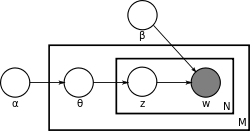

```{r setup, include=FALSE}
knitr::opts_chunk$set(echo = FALSE)

# Learn more about creating websites with Distill at:
# https://rstudio.github.io/distill/website.html

```


## Why is this important 

When it comes to **risk communication** it is extremely important how this communication takes place, what is being said, how it is said and of course who is sharing that information to build the population's **trust** in the information that is being shared. As most scientific experts share this kind of information it has an enormous influence on the audience's trust in science. And this also has a huge **impact on the behavior** of the audience. (brauchen wir Quellenangaben?).

Therefore it is of great importance to investigate how people perceive communicating experts. The **Virologist Christian Drosten** is such an expert and has become a **star on Twitter** in the Corona year. In 2020, the medical expert recorded the largest growth in followers in Germany on the social network, according to the U.S. company's annual review for Germany. The pandemic is probably responsible for Drosten's fame - the country hardly looks to any other expert more during the crisis.

Followingly, this project takes a closer look at how the german-speaking population perceived this expert's scientific communication displayed by their **tweets mentioning #Drosten**.  

## Research Questions

1. Can we discover patterns in reactions to the communication of scientific experts using Latent Dirichlet Allocation (LDA)?  

2. Is it possible to detect temporal trends in Twitter reactions to science communication of Christian Drosten using the topics generated from the LDA?

## method: Latent Dirichlet Allocation



LDA is a generative probabilistic model of a corpus. 

The basic idea is that documents (here Tweets) are represented as random mixtures over latent topics, 
where each topic is characterized by a distribution over words.

